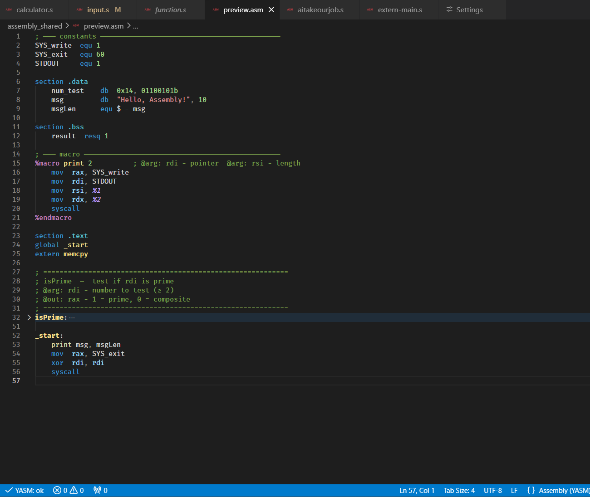
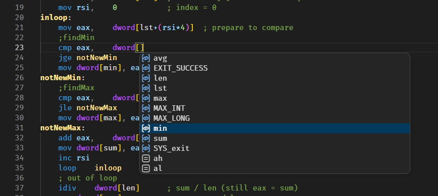
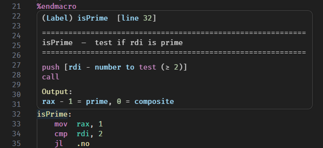

# Assembly YASM Helper

Advanced language support for **YASM / NASM Assembly** in Visual Studio Code.

---

## Preview



---

# 🚀 Features

## Intelligent Autocomplete



Context-aware suggestions based on cursor position:

- **Instructions & operands** — suggests registers, variables, labels, and size keywords filtered by the instruction's valid operand types
- **Memory brackets `[...]`** — walks a state machine (`base + index * scale`) and suggests only what fits at each position
- **`global` / `extern`** — `global` suggests labels and procs from the current file; `extern` suggests `global` symbols from other workspace files with source file shown in detail
- **Data sections** — suggests `db`, `dw`, `dd`, `dq`, `resb`, `resw`, `resd`, `resq`, `equ` after a variable name; after the directive, suggests existing vars, labels, and defines as values
- **Root level** — `section .text/data/bss`, `global`, `extern` only at line start
- **Preprocessor** — typing `%` suggests all directives (`%include`, `%macro`, `%define`, `%if`, `%rep`…) plus macro arguments `%1`…`%N` inside a macro body

## 🧭 Navigation

- **Go to Definition (F12)** — jumps to labels, variables, procs, and macros; local labels (`.done`, `.loop`) resolve to the correct parent scope; `extern` symbols jump directly to the declaring file
- **Cross-file extern** — workspace is indexed on activation; `extern` symbols are resolved to their source files via a `FileSystemWatcher`-backed cache
- **Find All References (Shift+F12)** — every usage of a label, variable, proc, or macro in the file
- **Rename Symbol (F2)** — renames all occurrences; guards against renaming keywords or registers
- **Document Symbol Outline** — labels, variables, procs, and macros in the Outline panel and breadcrumb
- **Signature Help** — shows operand hints while typing (e.g. `mov <dst>, <src>`), active parameter highlighted
- **Code Folding** — folds `proc`/`endp`, `%macro`/`%endmacro`, `struc`/`ends`, `section` blocks, and plain-label functions (`label:` … `ret`)

## 🎨 Syntax Highlighting

Instructions, registers (GP / SSE / AVX / AVX-512), labels, variables, directives, numbers, operators, and preprocessor directives are all distinctly colored. Numbers support `0x1F`, `1Fh`, and `1010b` formats.

Three built-in themes: **Assembly Dark**, **Assembly Light**, **Assembly High Contrast**.

## 🔍 Hover Information



- **Instructions** — description, syntax, and valid operand forms
- **Registers & numbers** — size, purpose, auto base conversion (dec / hex / bin)
- **Variables & labels** — type, section, line number; JSDoc `@arg`/`@out` from comments above the definition
- **Extern symbols** — when resolved to a single file, shows source file, line, and doc comments from the declaring file; when multiple files declare the same symbol, shows the full list

## 🔴 Code Diagnostics

Real-time static analysis detects:

- Duplicate labels and jumps to undefined labels
- Unclosed blocks (`proc/endp`, `%macro/%endmacro`, `%if/%endif`)
- Operand errors — missing operands, invalid types, size mismatches

## 🏃 Build & Run

Assembles and runs the current file in the integrated terminal. Automatically detects `extern` dependencies, assembles all required files, and links them together.

Command: **Assembly: Build & Run** (via Command Palette)

## 🐛 Debug with DDD

Assembles with debug symbols and launches [DDD](https://www.gnu.org/software/ddd/) for graphical debugging.

Command: **Assembly: Debug with DDD** (via Command Palette)

## ⚙ Compiler Integration (Optional)

Compile on save using YASM or NASM. Errors appear inline in VS Code and in the status bar (`✓ ok` / `✗ N error(s)` / `⚠ compiler not found`).

---

# ⚙ Configuration

| Setting | Default | Description |
|---------|---------|-------------|
| `assembly.compilerPath` | auto | Path to YASM/NASM executable |
| `assembly.compilerType` | `yasm` | `yasm` or `nasm` |
| `assembly.compilerFormat` | `elf64` | Output format (`elf32`, `elf64`, `win64`, `macho64`…) |
| `assembly.compilerDebugInfo` | `dwarf2` | Debug info format (`none`, `dwarf2`, `stabs`) |
| `assembly.outputExtension` | `o` | Object file extension (`o` or `obj`) |
| `assembly.enableCompilerCheck` | `true` | Compiler check on save |
| `assembly.enableGoToDefinition` | `true` | F12 Go to Definition |
| `assembly.enableDocumentSymbols` | `true` | Outline panel symbols |
| `assembly.enableSignatureHelp` | `true` | Operand hints while typing |
| `assembly.tabTriggerCompletions` | `false` | Show completions when Tab is pressed |
| `assembly.tabSize` | `8` | Indentation width (2, 4, or 8) |
| `assembly.linkerPath` | auto | Path to linker (`ld`) for Build & Run |
| `assembly.entryPoint` | `_start` | Entry point symbol passed to linker |
| `assembly.dddPath` | auto | Path to `ddd` executable |
| `assembly.dddDebugger` | `gdb` | Debugger backend for DDD (`gdb`, `dbx`, `wdb`) |

---

# 📂 Supported File Types

`.asm` `.s` `.S`

---

# 📋 Requirements

- Visual Studio Code **v1.48.0 or newer**
- YASM or NASM installed *(optional — required only for compiler check and Build & Run)*

---

# 🖥 Neovim Setup

This extension also ships a standalone LSP server for Neovim and any LSP-compatible editor.

### 1. Install the LSP server

```sh
npm install -g assembly-yasm-helper
```

### 2. Add to your Neovim config

For **LazyVim** / **NvChad** (nvim-lspconfig v2.x):

```lua
-- ~/.config/nvim/lua/plugins/asm-lsp.lua
return {
  {
    "neovim/nvim-lspconfig",
    opts = function(_, opts)
      vim.lsp.config('assembly_yasm', {
        cmd = { 'assembly-yasm-lsp', '--stdio' },
        filetypes = { 'asm' },
        root_markers = { '.git' },
      })
      vim.lsp.enable('assembly_yasm')
    end,
  },
}
```

### 3. Filetype detection (if `.asm` files aren't recognized)

```lua
vim.filetype.add({ extension = { asm = 'asm', s = 'asm', S = 'asm' } })
```

### Supported features in Neovim

| Feature | Status |
|---------|--------|
| Completion | ✓ |
| Hover | ✓ |
| Go to Definition | ✓ |
| Document Symbols | ✓ |
| Signature Help | ✓ |
| References | ✓ |
| Diagnostics | ✓ |
| Semantic Tokens | ✓ |
| Compiler Check (on save) | ✓ |

---

# 👨‍💻 Publisher

Developed by **Roncho**
Extended and maintained by **VVeb1250**
